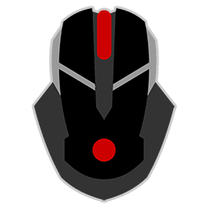

# Mouse Jiggler

You can run this program  from the USB Drive or, copy one or both files to a place on your hard drive (i.e My Documents) and run from there. There will be a tray icon (bottom  left corner by the clock) that you can right click on for the option to run on startup, pause/resume, and exit. The jiggler will quickly move your mouse a small amount and then back to the original position, every minute your computer is idle. It can run while you work and will not get in your way. You can set it and forget it!

## Download

*__The compiled exe file is not digitally signed and may throw a download security error in your web browser__*. It is safe to download and run, but if you prefer to run the [uncompiled AutoHotKey script](https://github.com/stevereich/mousejiggler/raw/master/MouseJiggler.ahk), you can download it instead. Please note, you will need to have [AutoHotKey](https://github.com/Lexikos/AutoHotkey_L/) installed on your computer for the uncompiled script to work.

* [mj32.exe](https://github.com/stevereich/mousejiggler/raw/master/mj32.exe) (will work on 32 and 64 bit Windows systems)
* [mj64.exe](https://github.com/stevereich/mousejiggler/raw/master/mj64.exe) (will work only on 64 bit Windows systems)
* [MouseJiggler.zip](https://github.com/stevereich/mousejiggler/raw/master/MouseJiggler.zip) (contains both versions)

### Which version of Windows do I have?
To find out if you have a 32bit or 64 bit version of Windows, go the Control Panel > Sytem. It will be listed under System Type.

---

  <a href="https://github.com/stevereich/mousejiggler">GIT Repository</a> 
  

